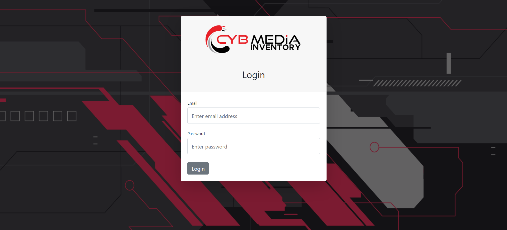
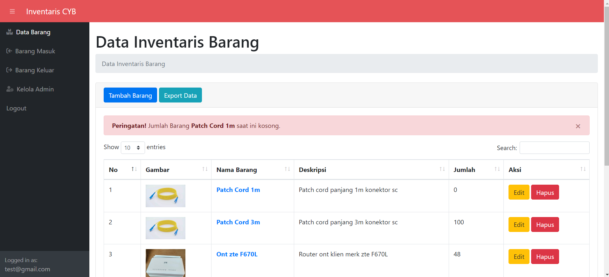
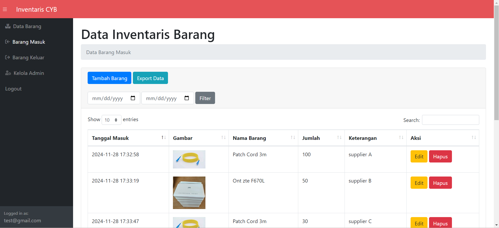
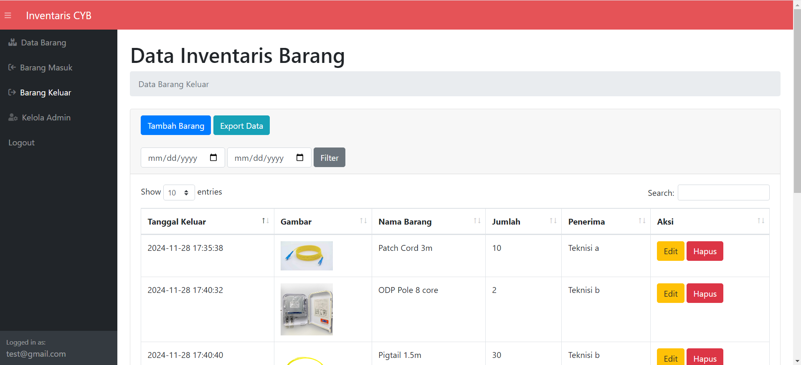
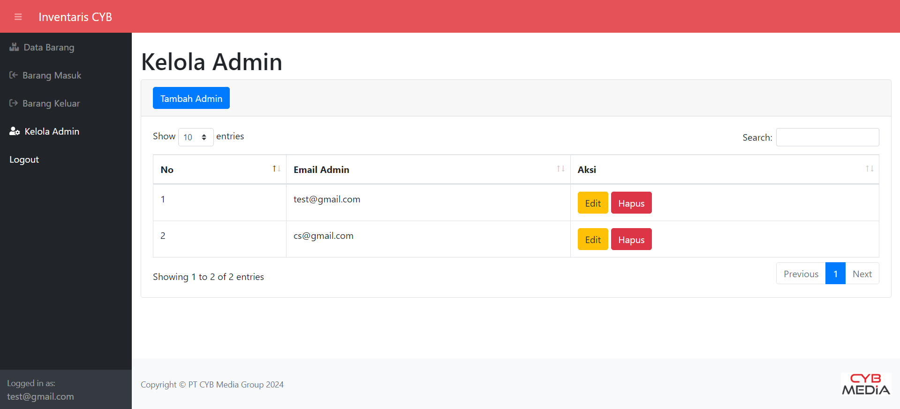
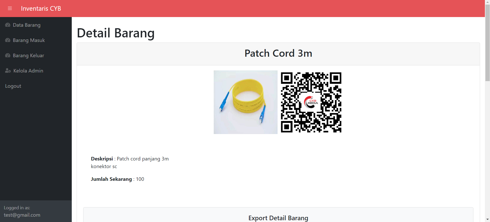
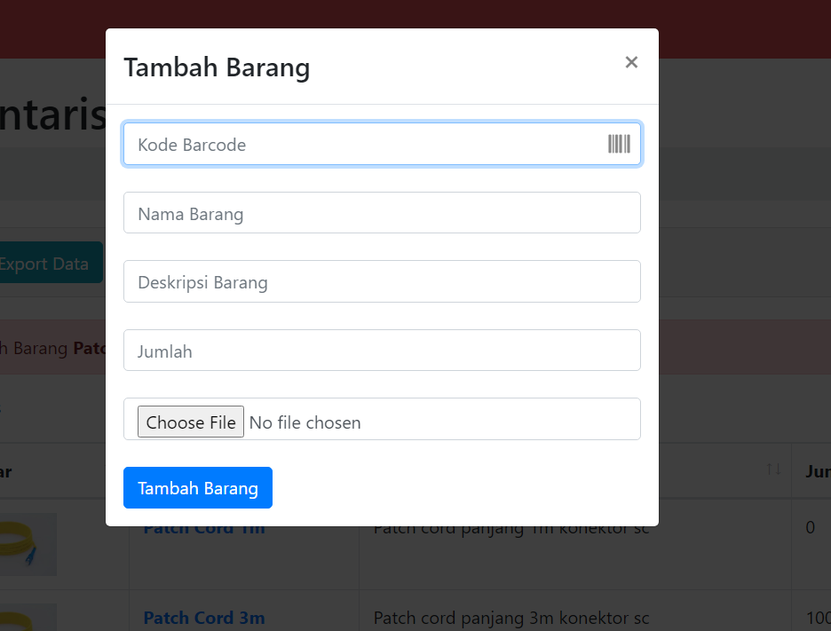
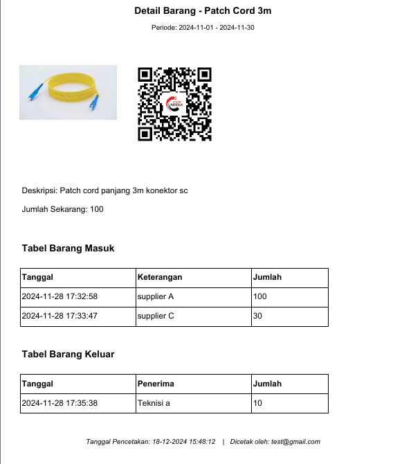

# Inventaris Barang PT CYB Media Group sistem CRUD

Sebuah proyek aplikasi berbasis web untuk sistem inventaris barang  di PT CYB Media Group sebagai pemenuhan tugas kerja praktek. Proyek ini dikembangkan dalam bentuk native (tanpa framework backend) menggunakan HTML, CSS, JavaScript, PHP, dan MySQL.

## Fitur Utama

1. **Manajemen Data Barang**
   - Tambah, edit, dan hapus data barang.
   - Menyimpan barcode untuk setiap barang.

2. **Barang Masuk dan Keluar**
   - Menambah catatan barang masuk dan keluar.
   - Sinkronisasi otomatis antara input barcode dan dropdown barang.

3. **Sinkronisasi Barcode**
   - Input barcode otomatis memilih barang terkait di dropdown.
   - Dropdown barang mengisi input barcode sesuai barang yang dipilih.

4. **Scan Barcode**
   - Mendukung pemindaian barcode menggunakan kamera perangkat (khusus smartphone).

5. **Manajemen Admin**
   - Tambah dan hapus pengguna admin.

6. **Feedback Pengguna**
   - Menampilkan pesan jika barcode tidak ditemukan.
   - Menampilkan notifikasi jika jumlah barang habis di halaman data barang.
   - menampilkan notifikasi jika jumlah barang yang keluar melebihi jumlah barang di data barang

7. **Export Data**
   - Export data detail barang dalam bentuk pdf yang sudah dilengkapi dengan fitur filter rentang tanggal
   - Export data ke dalam format lain seperti text only, csv, excel, pdf.

8. **Generate QrCode**
   - Fitur untuk generate QrCode dari pdf yang dicetak di halaman detail barang, bisa digunakan untuk validasi data tanpa login ke sistem

## Teknologi yang Digunakan

- **Frontend**: HTML, CSS (dengan Bootstrap untuk beberapa komponen), JavaScript.
- **Backend**: PHP Native.
- **Database**: MySQL.

## Struktur Direktori

```plaintext
project-root/
|-- assets/                    # Folder untuk file aset seperti gambar, ikon, atau style tambahan.
|   |-- img/                   # Folder untuk menyimpan gambar (favicon, logo, dll).
|   |   |-- favicon.ico        # Ikon untuk ditampilkan di browser tab.
|   |   |-- ...                # Gambar lainnya yang digunakan pada website.
|-- css/                       # Folder untuk file CSS.
|   |-- styles.css             # File utama untuk style global website.
|   |-- custom-styles.css      # File untuk style tambahan atau custom.
|-- js/                        # Folder untuk file JavaScript.
|   |-- script.js              # File JavaScript untuk fungsi tambahan di seluruh website.
|   |-- script_keluar.js       # File JavaScript untuk sinkronisasi barcode dan barang di fitur tambah barang keluar.
|   |-- script_masuk.js        # File JavaScript untuk sinkronisasi barcode dan barang di fitur tambah barang masuk.
|-- libs/                      # Folder untuk library pihak ketiga.
|   |-- fpdf/                  # Library untuk membuat file PDF.
|   |-- ...                    # Library tambahan lainnya.
|-- qrcode/                    # Folder untuk menyimpan sementara QR code yang dihasilkan sebelum ditampilkan.
|   |-- ...                    # File QR code sementara.
|-- .htaccess                  # File konfigurasi Apache untuk pengaturan akses website.
|-- old.htaccess               # Backup file konfigurasi Apache lama.
|-- admin.php                  # Halaman untuk kelola admin.
|-- cek.php                    # Script untuk mengecek sesi login pengguna.
|-- detail.php                 # Halaman untuk menampilkan detail barang.
|-- export_detail_barang.php   # Script untuk mengekspor detail barang ke Excel.
|-- export_keluar.php          # Script untuk mengekspor data barang keluar ke Excel.
|-- export_masuk.php           # Script untuk mengekspor data barang masuk ke Excel.
|-- export.php                 # Halaman utama untuk memilih jenis data yang akan diekspor.
|-- function.php               # File yang berisi fungsi-fungsi PHP yang digunakan secara global.
|-- get_barang_by_barcode.php  # API untuk mencari barang berdasarkan barcode yang diinputkan.
|-- index.php                  # Halaman utama untuk menampilkan daftar barang.
|-- keluar.php                 # Halaman untuk menambahkan data barang keluar.
|-- login.php                  # Halaman untuk proses login pengguna.
|-- logout.php                 # Halaman untuk proses logout pengguna.
|-- masuk.php                  # Halaman untuk menambahkan data barang masuk.
|-- test.php                   # File untuk testing fitur (bisa dihapus di produksi).
|-- view.php                   # File untuk menampilkan data berdasarkan request tertentu.
```

## Instalasi

1. Clone repository ini:

   ```bash
   git clone https://github.com/framastoando/project_inventory_cyb
   ```

2. Upload file ke server hosting atau gunakan server lokal seperti XAMPP/LAMP/MAMP.

3. Buat database baru di MySQL dan impor file SQL:

   ```sql
   CREATE DATABASE inventaris;
   USE inventaris;
   SOURCE inventory_db.sql;
   ```

4. Edit baris koneksi ke database di `function.php` untuk menyesuaikan kredensial database:

   ```php
   $conn = mysqli_connect("host", "username", "password", "database_name");
   ```

5. Akses aplikasi melalui browser/url hosting:

   ```plaintext
   http://localhost/inventaris
   ```

## Cara Penggunaan

1. Login sebagai admin.
2. Tambah data barang dengan mengisi informasi lengkap, termasuk barcode.
3. Gunakan fitur barang masuk dan keluar untuk mencatat perubahan inventaris.
4. Gunakan scanner barcode (jika tersedia) untuk mempermudah input data.
5. Manajemen dengan menambah atau menghapus admin inventaris.
6. Masuk ke halaman detail barang dengan klik nama barang di halaman data barang.

## Catatan Penting

- Pastikan koneksi database sudah sesuai.
- Ukuran file gambar barang dibatasi maksimal 5 MB.
- Format gambar yang didukung: PNG, JPG, JPEG.

## Preview Halaman website
Berikut adalah tampilan website Inventaris CYB:

### Halaman Login

---
### Dashboard Data Barang

---
### Halaman Barang Masuk

---
### Halaman Barang Keluar 

---
### Halaman Manajemen Admin

---
### Halaman Detail Barang

---
### Fitur Tambah Barang

---
### Contoh Export

---


